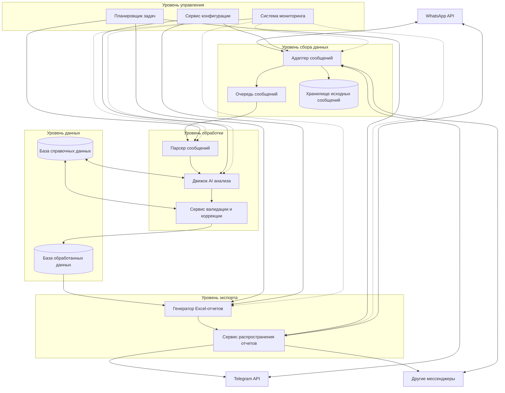

# Сервис структурирования сообщений от агрономов: High-Level Design

## Обзор архитектуры

Предлагаю разработать модульную, распределенную систему для автоматизации сбора, анализа и структурирования сообщений от агрономов. Система должна обеспечивать гибкость в плане источников данных (различные мессенджеры), надежную обработку и анализ сообщений, а также автоматическое формирование отчетов.

## Компонентная модель



## Описание ключевых компонентов

### 1. Адаптер сообщений

- **Назначение**: Обеспечивает унифицированный интерфейс для взаимодействия с различными мессенджерами
- **Протоколы**:
    - REST API для WhatsApp Business API
    - REST API для Telegram Bot API
    - Шаблон адаптера для подключения новых мессенджеров
- **Технологии**:
    - Python с соответствующими клиентскими библиотеками
    - Шаблон проектирования "Адаптер" для абстрагирования от конкретных платформ

### 2. Очередь сообщений

- **Назначение**: Буферизация сообщений для надежной и асинхронной обработки
- **Технологии**:
    - Redis или RabbitMQ для легковесной, надежной очереди
    - Маршрутизация на основе топиков для разных типов сообщений
- **Протоколы**:
    - AMQP для RabbitMQ
    - Redis Pub/Sub протокол

### 3. Хранилище исходных сообщений

- **Назначение**: Хранение всех входящих сообщений в исходном виде для аудита и повторной обработки
- **Технологии**:
    - MongoDB или аналогичное документоориентированное хранилище
    - S3-совместимое объектное хранилище для вложений и скриншотов
- **Модель данных**:
    - Документоориентированная схема с метаданными сообщений
    - Индексирование по дате и источнику сообщения

### 4. Парсер сообщений

- **Назначение**: Извлечение и нормализация текстового содержимого из сообщений
- **Технологии**:
    - Python с библиотеками NLP
    - OCR-возможности для обработки скриншотов (Tesseract, EasyOCR)
- **Алгоритмы**:
    - Распознавание текста в изображениях
    - Предварительная обработка текста (нормализация, удаление шума)

### 5. Движок AI анализа

- **Назначение**: Структурирование неструктурированного текста в значимые данные
- **Технологии**:
    - LLM-модели для понимания текста (GPT, Claude)
    - Специализированное NER (распознавание именованных сущностей) для сельскохозяйственных терминов
    - Распознавание шаблонов для извлечения данных
- **Модель обработки**:
    - Извлечение структурированной информации (операции, культуры, площади, урожайность)
    - Классификация типов сельскохозяйственных работ
    - Определение географических и временных атрибутов

### 6. База справочных данных

- **Назначение**: Хранение справочной информации (операции, культуры, подразделения и т.д.)
- **Технологии**:
    - PostgreSQL или аналогичная реляционная база данных
    - Регулярные обновления из мастер-источников данных
- **Модель данных**:
    - Нормализованная реляционная схема с отношениями между сущностями
    - Версионирование справочных данных

### 7. Сервис валидации и коррекции

- **Назначение**: Проверка извлеченных данных и исправление ошибок
- **Технологии**:
    - Валидация на основе правил
    - Алгоритмы нечеткого сопоставления для исправления
    - Оценка достоверности для извлеченных сущностей
- **Алгоритмы**:
    - Проверка данных по справочникам
    - Обнаружение и исправление опечаток
    - Формирование запросов на уточнение при неразрешимых проблемах

### 8. База обработанных данных

- **Назначение**: Хранение структурированных данных после обработки
- **Технологии**:
    - PostgreSQL или аналогичная реляционная база данных
    - Оптимизация для временных рядов и отчетности
- **Модель данных**:
    - Структурированная схема для сельскохозяйственных операций
    - Индексирование по времени, подразделениям и типам работ

### 9. Генератор Excel-отчетов

- **Назначение**: Формирование Excel-отчетов из обработанных данных
- **Технологии**:
    - Python с библиотеками openpyxl или pandas
    - Система шаблонов для форматов отчетов
- **Функциональность**:
    - Генерация табличных отчетов по заданным шаблонам
    - Агрегация и суммирование данных
    - Форматирование согласно корпоративным стандартам

### 10. Сервис распространения отчетов

- **Назначение**: Отправка отчетов получателям через мессенджеры
- **Технологии**:
    - Использует тот же Адаптер сообщений для отправки
    - Шаблонизация для сопроводительных сообщений
- **Протоколы**:
    - Использует API мессенджеров для отправки файлов и уведомлений
    - Поддержка расписания рассылки

### 11. Планировщик задач

- **Назначение**: Планирование задач обработки и отчетности
- **Технологии**:
    - Celery или аналогичная очередь задач
    - Cron-подобные возможности планирования
- **Функциональность**:
    - Запуск задач по расписанию (утренняя генерация отчетов)
    - Мониторинг выполнения задач
    - Перезапуск при сбоях

### 12. Сервис конфигурации

- **Назначение**: Управление конфигурацией и настройками системы
- **Технологии**:
    - Переменные окружения
    - Конфигурационные файлы
    - Переключатели функций
- **Функциональность**:
    - Централизованное управление настройками всех компонентов
    - Возможность "горячего" изменения конфигурации

### 13. Система мониторинга

- **Назначение**: Отслеживание работоспособности и активности системы
- **Технологии**:
    - Prometheus для метрик
    - ELK-стек для логирования
    - Возможности оповещения
- **Функциональность**:
    - Сбор и визуализация метрик производительности
    - Анализ логов и выявление проблем
    - Оповещение о критических ситуациях

## Протоколы взаимодействия

### Внешние интерфейсы

1. **Интерфейс мессенджеров**
    - **WhatsApp Business API**: REST API с аутентификацией на основе токенов
    - **Telegram Bot API**: REST API с аутентификацией на основе ботов
    - **Другие мессенджеры**: Специфичные для каждой платформы API

### Внутренние интерфейсы

1. **Очередь → Парсер**
    - Асинхронная очередь сообщений (AMQP или Redis Pub/Sub)
    - Гарантированная доставка сообщений с подтверждением обработки
2. **Парсер → Движок AI**
    - Синхронный REST API или gRPC
    - Передача предварительно обработанного текста и метаданных
3. **Движок AI → Валидатор**
    - Синхронный REST API или gRPC
    - Передача структурированных данных для валидации
4. **Компоненты → Базы данных**
    - SQL для реляционных баз (PostgreSQL)
    - MongoDB Query API для документной базы
    - S3 API для объектного хранилища
5. **Генератор отчетов → Сервис распространения**
    - REST API или обмен через файловую систему
    - Включение метаданных о распространении вместе с отчетами

## Системы хранения данных

1. **Хранилище исходных сообщений**
    - **Технология**: MongoDB (для сообщений), S3 (для вложений и скриншотов)
    - **Схема**:
        
        ```json
        {
          id: UUID,
          source: String, // "whatsapp", "telegram", etc.
          timestamp: DateTime,
          sender: {
            id: String,
            name: String,
            role: String
          },
          content: {
            type: String, // "text", "image", "file"
            value: String, // текст или URL к файлу
            attachments: [
              {
                type: String,
                url: String,
                metadata: Object
              }
            ]
          },
          metadata: Object
        }
        
        ```
        
2. **База справочных данных**
    - **Технология**: PostgreSQL
    - **Основные таблицы**:
        - Операции (operations)
        - Культуры (crops)
        - Подразделения (divisions)
        - Отделения (departments)
        - Соответствия подразделений и отделений (division_department_mappings)
3. **База обработанных данных**
    - **Технология**: PostgreSQL
    - **Основные таблицы**:
        - Сообщения (messages) - связь с исходными сообщениями
        - Операции (operations) - извлеченные данные о сельхозоперациях
        - Отчеты (reports) - сгенерированные отчеты
        - История корректировок (correction_history)

## Вопросы масштабирования и отказоустойчивости

1. **Горизонтальное масштабирование**
    - Компоненты могут разворачиваться независимо и масштабироваться горизонтально
    - Очереди сообщений обеспечивают распределение нагрузки
2. **Отказоустойчивость**
    - Сохранение всех исходных сообщений позволяет повторно обработать данные при сбоях
    - Система мониторинга обеспечивает раннее выявление проблем
3. **Расширяемость**
    - Модульная архитектура позволяет легко интегрировать новые источники данных (мессенджеры)
    - Шаблон адаптера для мессенджеров обеспечивает единый интерфейс для различных платформ

## Ключевые технологические решения

1. **Интеграция с мессенджерами**
    - WhatsApp Business API через официальный API или сторонние сервисы
    - Telegram Bot API через официальную библиотеку python-telegram-bot
    - Абстрактный интерфейс для подключения новых мессенджеров
2. **Обработка неструктурированных данных**
    - Использование LLM (например, GPT или Claude) для извлечения структурированной информации
    - Специализированные модели NER, обученные на сельскохозяйственной терминологии
    - OCR для извлечения текста из скриншотов и изображений
3. **Поддержка различных форматов данных**
    - Обработка текстовых сообщений в различных форматах
    - Распознавание изображений со скриншотами отчетов
    - Извлечение данных из прикрепленных файлов
4. **Архитектурные решения**
    - Микросервисная архитектура для гибкости и масштабируемости
    - Очереди сообщений для надежного асинхронного взаимодействия
    - Контейнеризация компонентов для легкого развертывания
5. **Интерфейс пользователя**
    - Веб-интерфейс для мониторинга и настройки системы
    - Возможность ручного вмешательства при необходимости верификации данных
    - Панель управления для отслеживания процесса обработки

## Заключение

Предложенная архитектура предоставляет полностью автоматизированное решение для извлечения, обработки и структурирования данных из сообщений агрономов, поступающих через различные мессенджеры. Система устроена так, чтобы быть расширяемой, надежной и способной адаптироваться к различным форматам входных данных. Модульный подход позволяет независимо развивать и улучшать отдельные компоненты системы без влияния на остальные части.